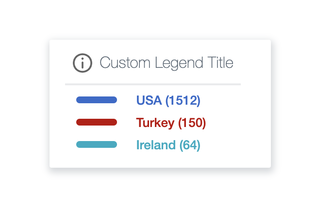

![Built With Stencil](https://img.shields.io/badge/-Built%20With%20Stencil-16161d.svg?logo=data%3Aimage%2Fsvg%2Bxml%3Bbase64%2CPD94bWwgdmVyc2lvbj0iMS4wIiBlbmNvZGluZz0idXRmLTgiPz4KPCEtLSBHZW5lcmF0b3I6IEFkb2JlIElsbHVzdHJhdG9yIDE5LjIuMSwgU1ZHIEV4cG9ydCBQbHVnLUluIC4gU1ZHIFZlcnNpb246IDYuMDAgQnVpbGQgMCkgIC0tPgo8c3ZnIHZlcnNpb249IjEuMSIgaWQ9IkxheWVyXzEiIHhtbG5zPSJodHRwOi8vd3d3LnczLm9yZy8yMDAwL3N2ZyIgeG1sbnM6eGxpbms9Imh0dHA6Ly93d3cudzMub3JnLzE5OTkveGxpbmsiIHg9IjBweCIgeT0iMHB4IgoJIHZpZXdCb3g9IjAgMCA1MTIgNTEyIiBzdHlsZT0iZW5hYmxlLWJhY2tncm91bmQ6bmV3IDAgMCA1MTIgNTEyOyIgeG1sOnNwYWNlPSJwcmVzZXJ2ZSI%2BCjxzdHlsZSB0eXBlPSJ0ZXh0L2NzcyI%2BCgkuc3Qwe2ZpbGw6I0ZGRkZGRjt9Cjwvc3R5bGU%2BCjxwYXRoIGNsYXNzPSJzdDAiIGQ9Ik00MjQuNywzNzMuOWMwLDM3LjYtNTUuMSw2OC42LTkyLjcsNjguNkgxODAuNGMtMzcuOSwwLTkyLjctMzAuNy05Mi43LTY4LjZ2LTMuNmgzMzYuOVYzNzMuOXoiLz4KPHBhdGggY2xhc3M9InN0MCIgZD0iTTQyNC43LDI5Mi4xSDE4MC40Yy0zNy42LDAtOTIuNy0zMS05Mi43LTY4LjZ2LTMuNkgzMzJjMzcuNiwwLDkyLjcsMzEsOTIuNyw2OC42VjI5Mi4xeiIvPgo8cGF0aCBjbGFzcz0ic3QwIiBkPSJNNDI0LjcsMTQxLjdIODcuN3YtMy42YzAtMzcuNiw1NC44LTY4LjYsOTIuNy02OC42SDMzMmMzNy45LDAsOTIuNywzMC43LDkyLjcsNjguNlYxNDEuN3oiLz4KPC9zdmc%2BCg%3D%3D&colorA=16161d&style=for-the-badge)


[](https://github.com/Paraboly/pwc-map-legend)


[](https://www.npmjs.com/package/@paraboly/wc-map-legend)
[](https://www.npmjs.com/package/@paraboly/wc-map-legend)

[](https://opensource.org/licenses/MIT)


<p align="center">
  
  
  
</p>


## Installation

### Script tag

- [Publish to NPM](https://docs.npmjs.com/getting-started/publishing-npm-packages)
- Put a script tag similar to this `<script	type="module" src="https://unpkg.com/@paraboly/wc-map-legend@0.0.4/dist/pwc-map-legend/pwc-map-legend.esm.js"></script>` in the head of your index.html
- Then you can use the element anywhere in your template, JSX, html etc

### Node Modules
- Run `npm install my-component --save`
- Put a script tag similar to this `<script src='node_modules/pwc-map-legend/dist/pwc-map-legend.js'></script>` in the head of your index.html
- Then you can use the element anywhere in your template, JSX, html etc

### In a stencil-starter app
- Run `npm install @paraboly/pwc-map-legend --save`
- Add an import to the npm packages `import @paraboly/pwc-map-legend;`
- Then you can use the element anywhere in your template, JSX, html etc


# Usage

## HTML Tag Prop Way

```html
 <pwc-map-legend
      counts='["1512","150","64"]'
      title-text="Custom Legend Title"
      color-array='["hello", "hello2"]'
      names='["USA", "Ireland","Turkey"]'
      colors='["#BD0003", "#3469CC", "darkGreen"]'
/>
```

## Javascript Way

```html 
<pwc-map-legend />
```

```js
var wc = document.querySelector('pwc-map-legend');
  wc.titleText = "Legend"
  wc.counts = [215, 610, 5111];
  wc.colors = ['red', 'blue', 'orange'];
  wc.names = ["Paraboly", "Google", "Apple"];
```

## Authors

SchemeSonic, haldun.yildiz@paraboly.com | haldun313@gmail.com
FreakyCoder, kuray.ogun@paraboly.com | kurayogun@gmail.com

## License

WebComponent PWC Map Legend is available under the MIT license. See the LICENSE file for more info.