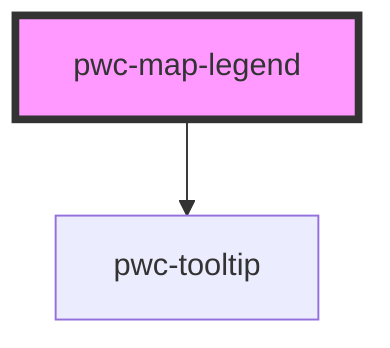

# pwc-map-legend

<!-- Auto Generated Below -->

## Properties

| Property         | Attribute         | Description                       | Type                       | Default               |
| ---------------- | ----------------- | --------------------------------- | -------------------------- | --------------------- |
| `disableTitle`   | `disable-title`   | Disable the title                 | `boolean`                  | `false`               |
| `disableTooltip` | `disable-tooltip` | Disable the tooltip               | `boolean`                  | `false`               |
| `entries`        | `entries`         |                                   | `ILegendEntry[] \| string` | `this.defaultEntries` |
| `legendText`     | `legend-text`     | Description of the legend tooltip | `string`                   | `"Legend"`            |
| `titleText`      | `title-text`      | Title of the legends              | `string`                   | `"Legend"`            |
| `tooltipProps`   | `tooltip-props`   |                                   | `any`                      | `undefined`           |

## Dependencies

### Depends on

- pwc-tooltip

### Graph

----------------------------------------------

*Built with [StencilJS](https://stenciljs.com/)*
